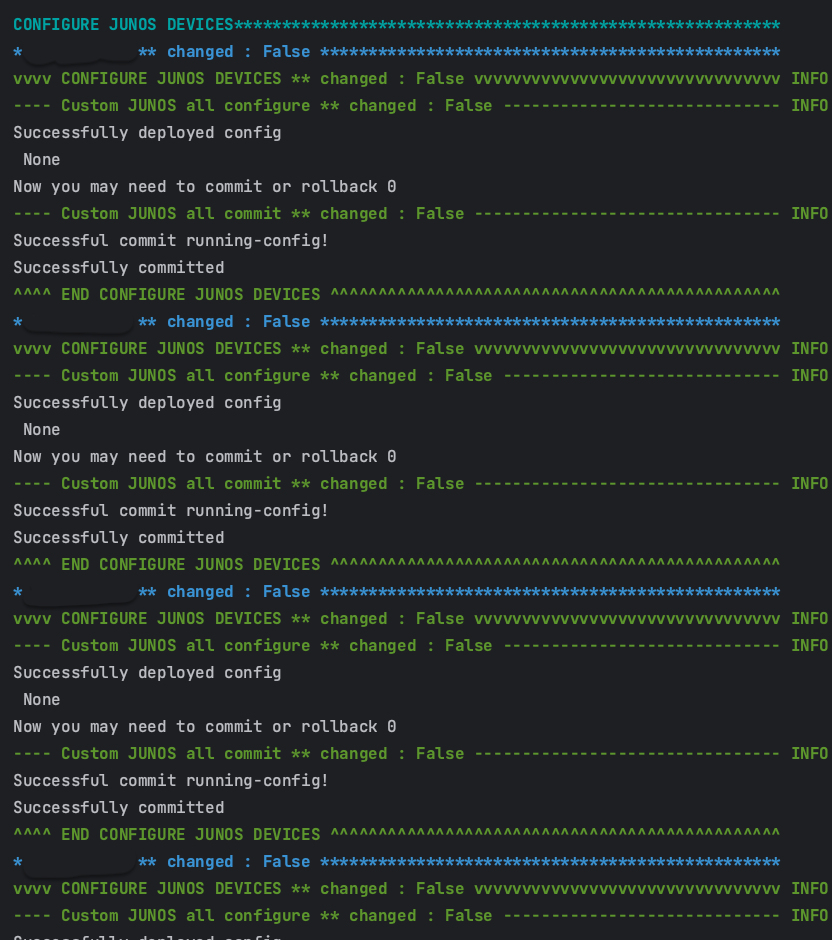
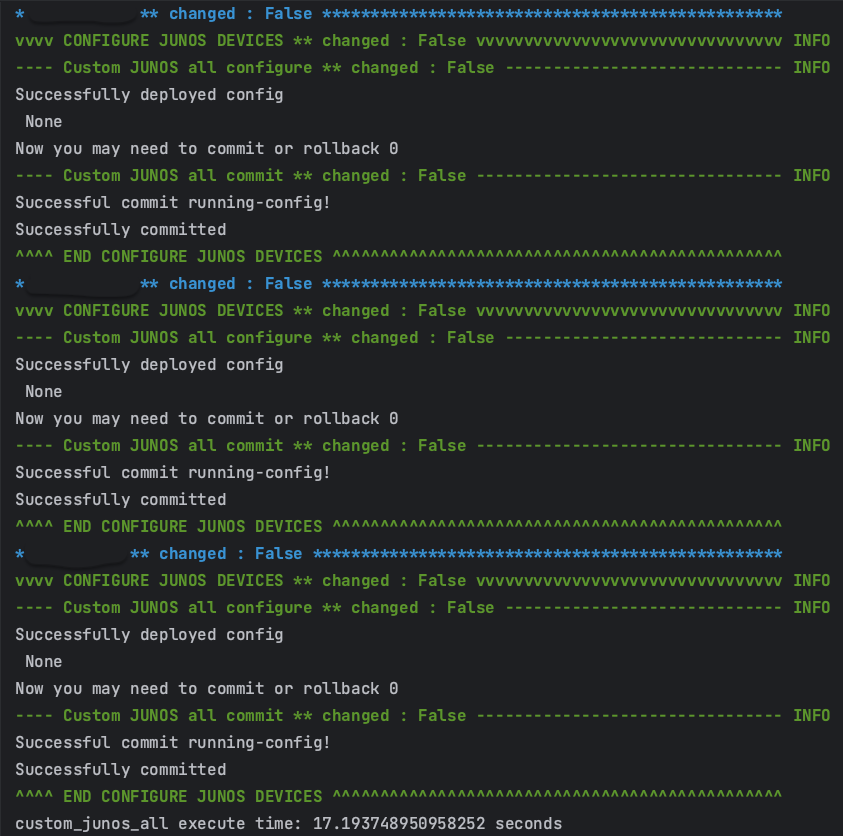
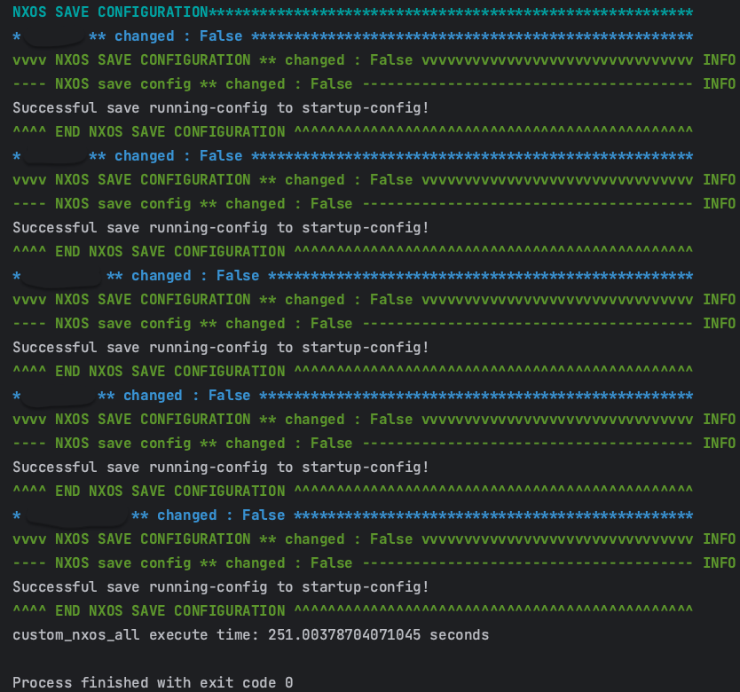
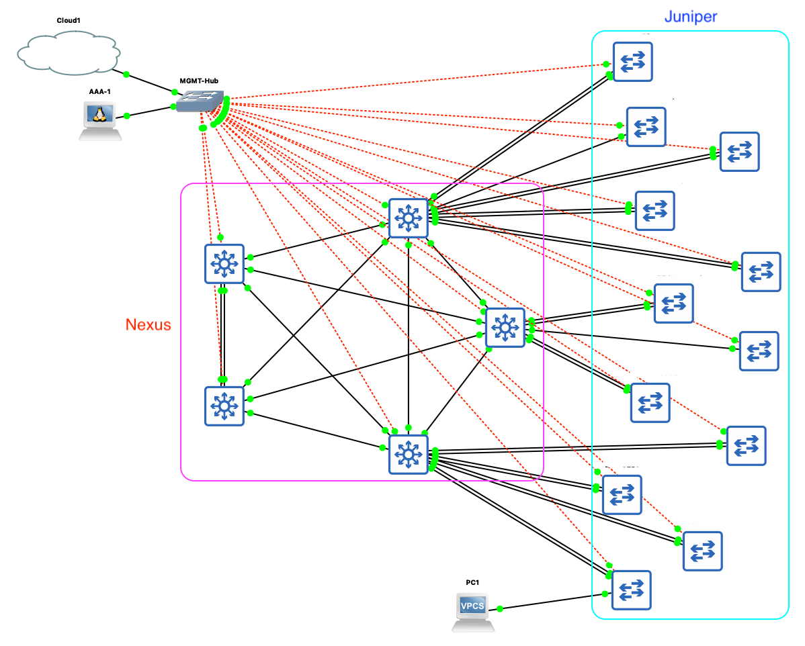

# NetDevOps-demo
This project is developed for internal production environment use within NYCU CSIT. It employs the Nornir framework for configuration deployment and utilizes pyATS for topology validation to implement NetDevOps. Due to organizational policies, some of the code will not be made public.

This example simulates a traditional three-tier network architecture, where 5 Nexus switches are used for the core and aggregation layers, and 12 Juniper EX2300 switches are used for the edge layer.


# Installation Packages
```
$ poetry install
```

# Pre-configuration (Include Real Devices)
## Juniper
- delete auto-image-upgrade
- set root password
- ssh & netconf
- MGMT
## Nexus
- disable POAP
- boot image
- admin password
- nxapi & restconf
- MGMT

# Screenshot Output
## JunOS



## NXOS



## GNS3 TOPOLOGY
