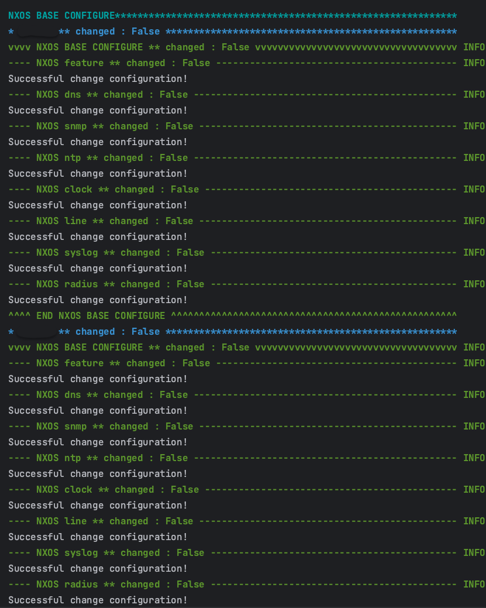

# NetDevOps-demo

## Installation Packages

```
$ poetry install
```

## Pre-configuration (Include Real Devices)
### Juniper
- delete auto-image-upgrade
- set root password
- ssh & netconf
- MGMT
### Nexus
- disable POAP
- boot image
- admin password
- nxapi & restconf
- MGMT

# Screenshot Output
## JunOS


## NXOS



## GNS3 TOPOLOGY
